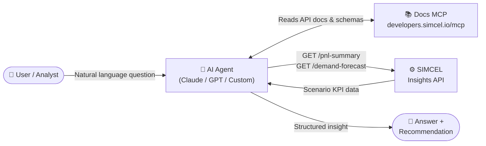
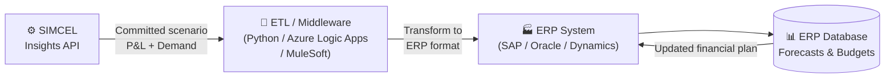
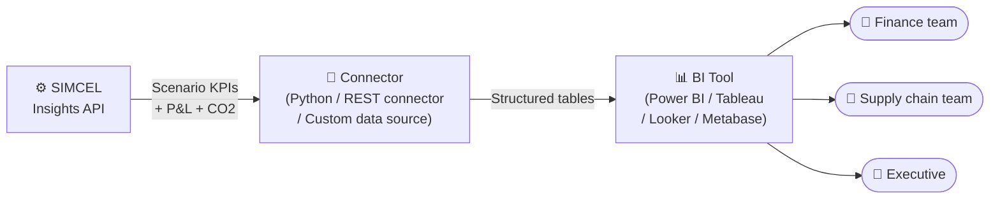
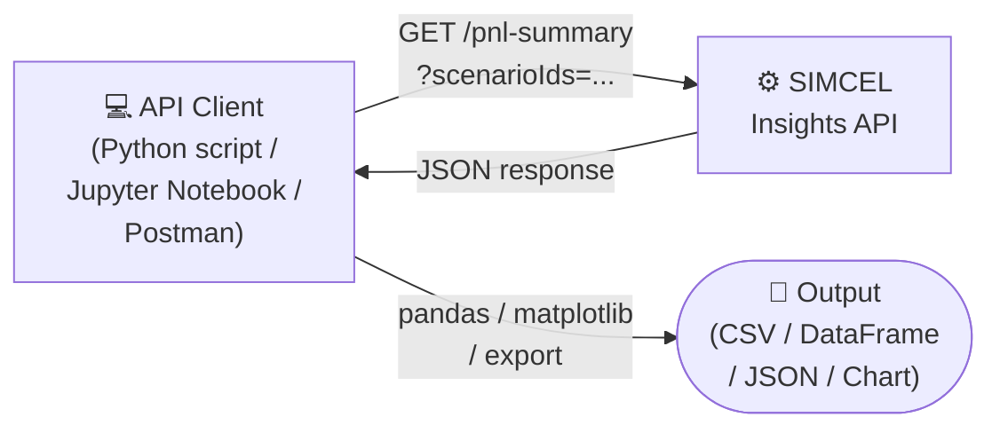

The SIMCEL Insights API is designed to sit at the center of your data ecosystem — connecting your supply chain simulation outputs to any downstream system, agent, or tool. Here are the most common integration patterns.

---

## Pattern 1: AI Agent

An AI agent uses the SIMCEL API as its "memory" for supply chain data. The agent receives a natural language question, fetches the relevant KPIs, and generates a structured answer or recommendation.



**Use case:** *"What is our EBIT margin gap between Committed and Optimistic scenarios for FY2025?"*

**Stack example:**
- Agent: Claude claude-opus-4-5 or GPT-4o with function calling
- Auth: SIMCEL API key stored in agent secrets
- MCP: `developers.simcel.io/mcp` for self-documenting context

**Key endpoints:** `GET /pnl-summary`, `GET /demand-forecast`

---

## Pattern 2: ERP Integration

SIMCEL scenario outputs feed into your ERP (SAP, Oracle, Microsoft Dynamics) to update financial forecasts, procurement orders, or production plans — keeping your operational system in sync with your planning scenarios.



**Use case:** Every Monday, pull the latest Committed scenario P&L and demand forecast, transform to SAP format, and push updated budget figures into SAP CO/PA.

**Stack example:**
- Scheduler: Azure Logic Apps or cron job
- Transform: Python pandas to map SIMCEL fields → SAP BAPI structure
- Push: SAP RFC / BAPI or REST API depending on version

**Key endpoints:** `GET /pnl-summary`, `GET /demand-forecast`

---

## Pattern 3: BI Dashboard

SIMCEL scenario data is pulled into a Business Intelligence tool (Power BI, Tableau, Looker) to build live, interactive dashboards that business users can explore — without needing access to the SIMCEL app itself.



**Use case:** A Power BI dashboard showing Committed vs Actual scenario comparison for EBIT, service levels, and CO2 — refreshed daily, accessible to 50+ business users.

**Stack example:**
- Connector: Python script using `requests` → writes to a SQL or Parquet file
- Refresh: Scheduled via Power BI gateway or Airflow DAG
- Visualisation: Power BI with scenario slicers and waterfall charts

**Key endpoints:** `GET /pnl-summary`, `GET /demand-forecast`, `GET /supply-performance`

---

## Pattern 4: Direct API Client

A developer or data scientist queries the SIMCEL API directly in a script, notebook, or application — no middleware needed. Ideal for ad-hoc analysis, model training, or lightweight integrations.



**Use case:** A data scientist pulls 12 months of demand data across 3 scenarios into a Jupyter notebook to train a demand sensing model.

**Stack example:**
```python
import requests
import pandas as pd

token = get_simcel_token()

resp = requests.get(
    "https://app.simcel.io/api/insights/v1/demand-forecast",
    headers={"Authorization": f"Bearer {token}"},
    params={
        "planId": "plan_9xKz2",
        "scenarioIds": "scen_committed,scen_optimistic,scen_actual",
        "interval": "M",
        "dateFrom": "2025-01-01",
        "dateTo": "2025-12-31",
    }
)

rows = []
for scenario in resp.json()["scenarios"]:
    for period in scenario["series"]:
        rows.append({
            "scenario": scenario["scenarioName"],
            "period": period["period"],
            "demandValue": period["demandValue"],
            "fillRate": period["fillRate"],
        })

df = pd.DataFrame(rows)
df.pivot(index="period", columns="scenario", values="demandValue").plot()
```

---

## Pattern 5: Slack / Teams Bot

An internal chatbot lets business users ask supply chain questions in plain language from Slack or Microsoft Teams — no login to SIMCEL required.

```mermaid
flowchart LR
    U(["👤 User in Slack\nor Teams"])
    BOT["🤖 Slack / Teams Bot\n(Bolt for Python\n/ Bot Framework)"]
    LLM["🧠 LLM\n(OpenAI / Claude)"]
    S["⚙️ SIMCEL\nInsights API"]

    U -->|@simcel what is our\nEBIT this quarter?| BOT
    BOT -->|Prompt + tools| LLM
    LLM -->|Tool call: get_pnl_summary| BOT
    BOT -->|API request| S
    S -->|KPI data| BOT
    BOT -->|LLM formats answer| LLM
    LLM -->|Formatted response| BOT
    BOT -->|Reply in channel| U
```

**Use case:** Finance or supply chain teams get instant answers like *"What's the service level in DC-PARIS this month?"* directly in Slack — without switching tools.

**Stack example:**
- Bot framework: Slack Bolt for Python or Microsoft Bot Framework
- LLM: OpenAI `gpt-4o` with function calling
- Deployment: AWS Lambda or a lightweight Docker container

**See the full implementation:** [Build your first AI Agent](/guides/first-ai-agent)

---

## Choosing the right pattern

| Pattern | Best for | Complexity | Time to build |
|---|---|---|---|
| AI Agent | Ad-hoc analysis, executive Q&A | Low | 1–2 days |
| ERP Integration | Automated budget sync, procurement | High | 2–4 weeks |
| BI Dashboard | Broad business user access, reporting | Medium | 3–5 days |
| Direct API Client | Data science, notebooks, prototyping | Very low | Hours |
| Slack / Teams Bot | Internal self-service, team alerts | Medium | 3–5 days |

<Note>
  All patterns share the same SIMCEL API credentials and rate limits. For high-volume integrations like ERP sync running multiple times per day, contact SIMCEL sales for enterprise planning.
</Note>


